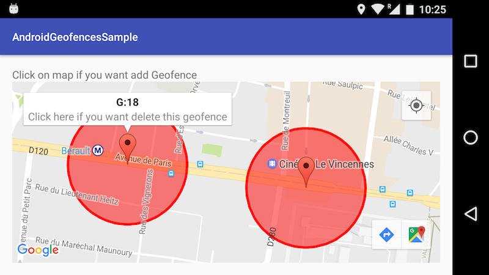

**Extended sample for Android GeofencingApi**

You can add your own geofences from map. Just click on map and geofence will be created.

To remove it just click on map marker and after that click on info wingow.

Youtube video: [https://youtu.be/ilfiMGuV-ng](https://youtu.be/ilfiMGuV-ng)

Application Screenshot

